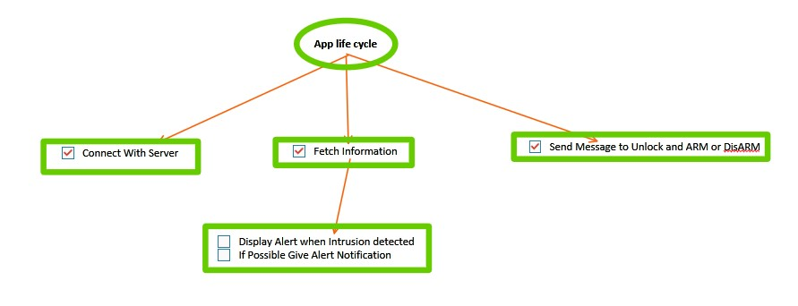
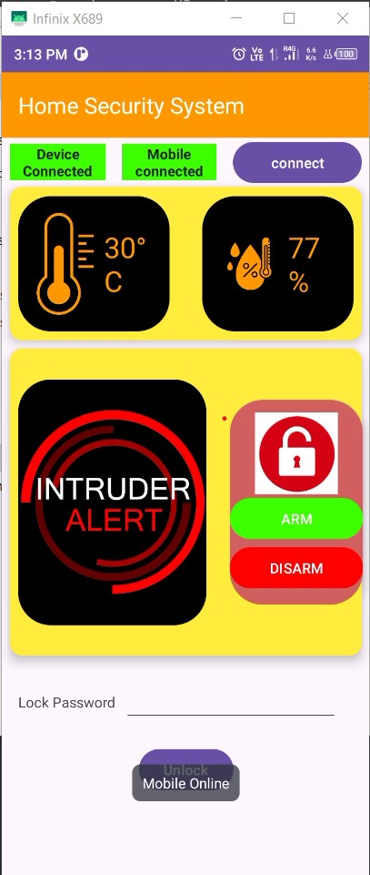
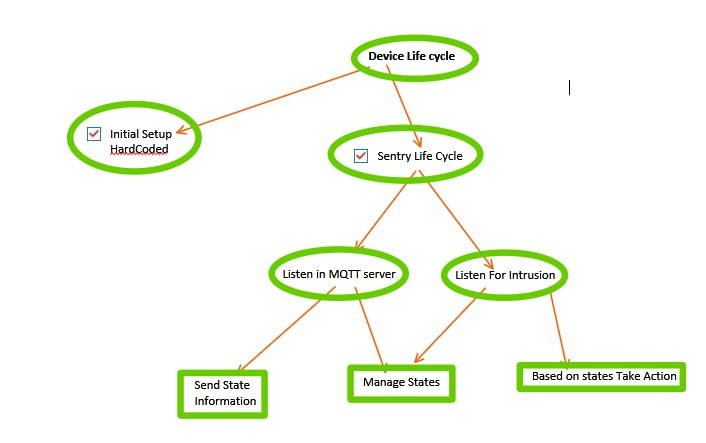
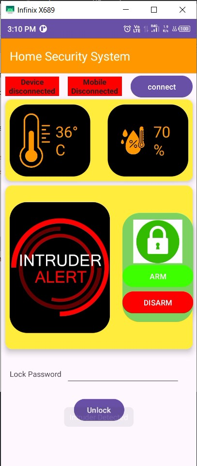
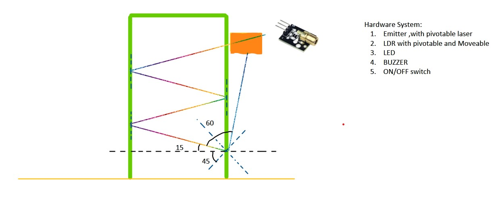
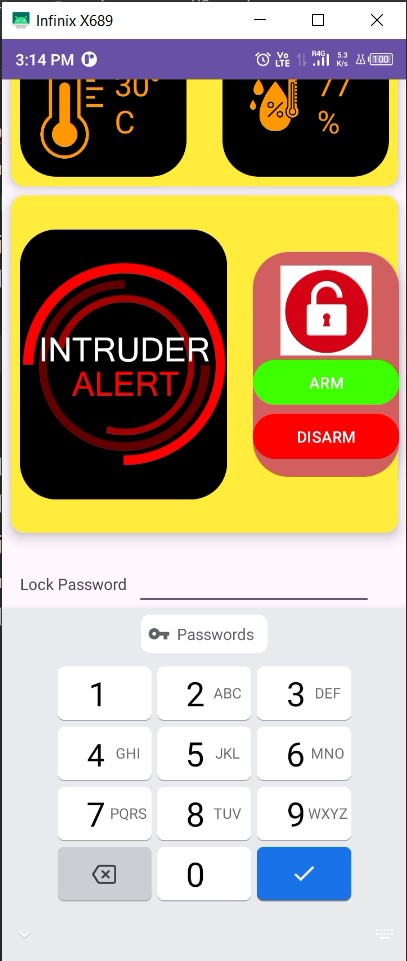
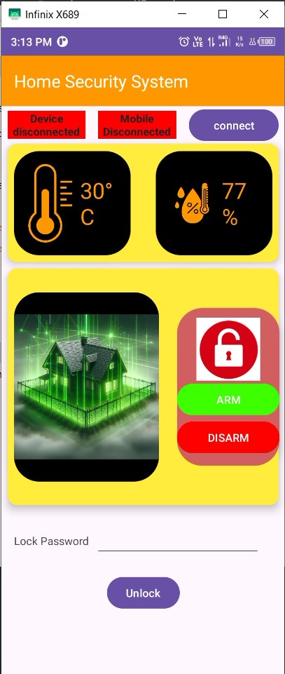
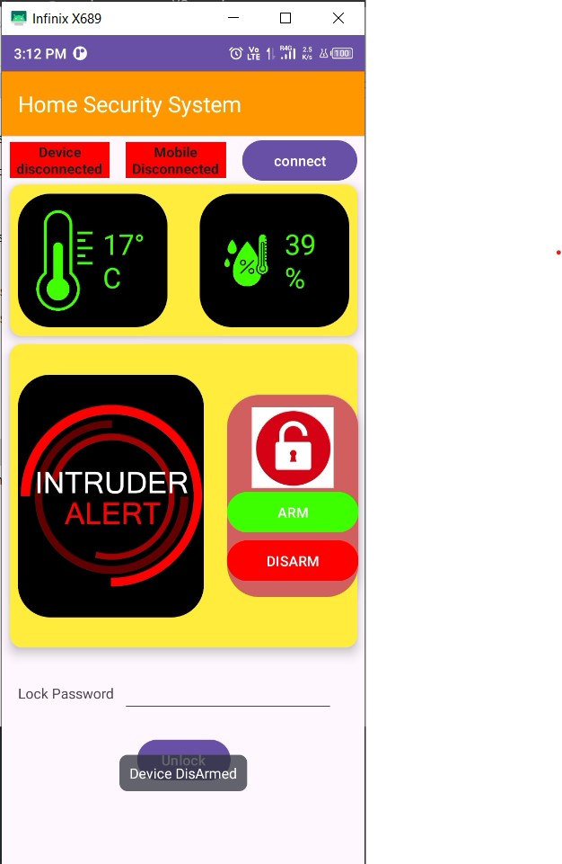
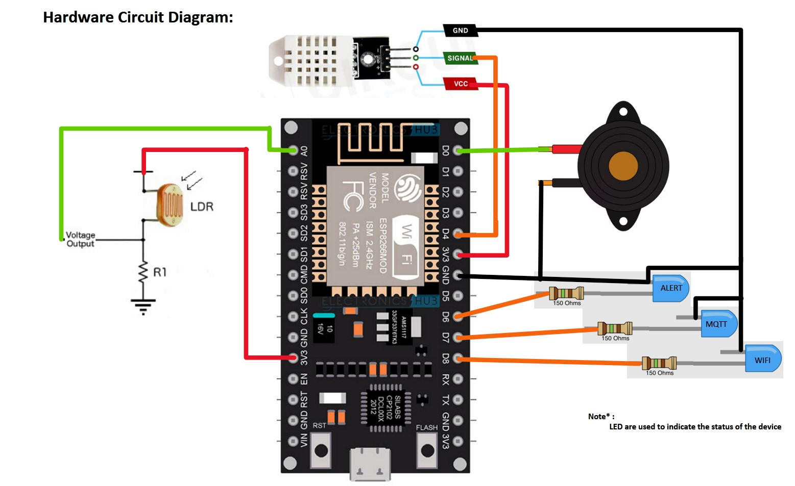

## Laser-Based Home Security System APP

This project implements a laser-based home security system that monitors the front of your house for potential perimeter breaches. It utilizes a low-latency communication system powered by the free HiveMQ MQTT server and synchronizes with a mobile application for real-time monitoring and control.

### Features

* **Low Latency:** The system leverages the HiveMQ MQTT server for efficient and near real-time communication, ensuring prompt response to potential threats.
* **Mobile App Integration:** A dedicated mobile application provides a user-friendly interface for monitoring the system status, receiving alerts, and controlling various functionalities.
* **Open-Source Hardware:** The hardware setup is based on an open-source design, allowing for customization and cost-effectiveness.

* **ServerLess Congfiguration:** There is no need of Server setup inbetween thereby reducing the cost of the project.

* **HiveMQ MQTT uses TLS Communication:** In Order to Establish Connection to the MQTT servert HiveMQ uses TLS communication for secure cryptographic communication
### Screenshots

#### AppLifeCycle

Description: The lifecycle of the mobile application, illustrating various states and transitions.

#### ConnectedToServerAndDeviceImage

Description: Confirmation of successful connection to both the MQTT server and the security system device.

#### DeviceLifeCycle

Description: The lifecycle of the security system device, depicting different operational states.

#### HardwareSchematics1

Description: Schematic diagram detailing the hardware setup of the security system.

#### IdleImage

Description: Visual representation of the security system in an idle state, awaiting potential threats.

#### MirrorAnglesSetup

Description: Configuration of mirror angles for optimal detection coverage of the perimeter.

#### MQTTStatesMaintained

Description: Maintenance of MQTT connection states for reliable communication between components.

#### PasswordBasedUnLockingSystem

Description: Implementation of a password-based unlocking system for secure access control.

#### SafeHomeResponse

Description: Prompt response by the security system ensuring a safe home environment.

#### TemperatureUIResponse

Description: User interface response to temperature fluctuations, providing visual feedback to the user.

#### CircuitDiagram For Referencs

Description: Schematic diagram detailing the circuit

### Hardware Setup

For detailed instructions on setting up the hardware components, please refer to the following GitHub repository:

[Link to Hardware Setup Repository](https://github.com/your-username/Laser-Based-Home-Security-System-Hardware)

### Mobile Application

The mobile application is currently under development and will be available soon. Stay tuned for updates!

### Contributing

Contributions are welcome! Please refer to the CONTRIBUTING.md file for guidelines on how to contribute to the project.

### License

This project is licensed under the MIT License - see the LICENSE.md file for details.
